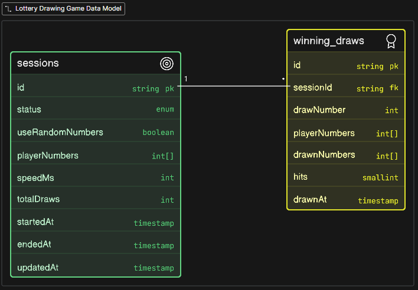
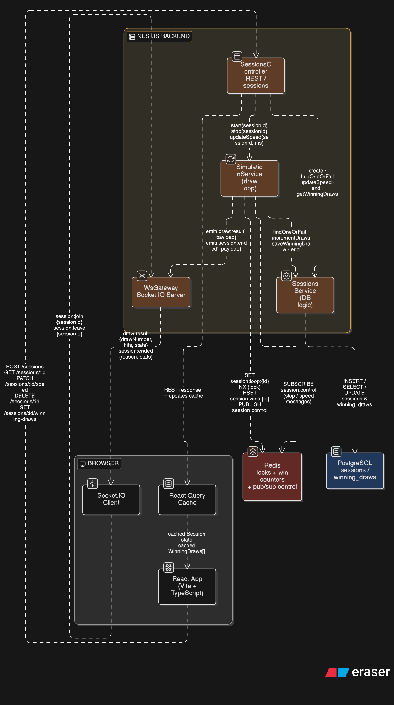

# Lottery Simulator

## Prerequisites

- [Docker](https://docs.docker.com/get-docker/) and [Docker Compose](https://docs.docker.com/compose/install/)

## Getting Started

### 1. Configure environment variables

Copy the example env files and adjust values if needed:

```bash
cp backend/.env.example backend/.env
cp frontend/.env.example frontend/.env
```

### 2. Start in development mode

```bash
docker-compose up --build
```

| Service  | URL                   |
| -------- | --------------------- |
| Frontend | http://localhost:5173 |
| Backend  | http://localhost:3000 |
| pgAdmin  | http://localhost:5050 |

Default pgAdmin credentials: `admin@admin.com` / `admin`

Source files are volume-mounted, so changes to `backend/` and `frontend/` are reflected immediately without rebuilding. Except node_modules, they have named volumes.

### 3. Start in production mode

```bash
docker-compose -f docker-compose.yml -f docker-compose.prod.yml up --build
```

| Service  | URL                   |
| -------- | --------------------- |
| Frontend | http://localhost:80   |
| Backend  | http://localhost:3000 |

pgAdmin is disabled in production by default.

### 4. Run migrations

```bash
DB_HOST=localhost pnpm migration:run
```

### Useful commands

```bash
# View logs
docker-compose logs -f

# View logs for a single service
docker-compose logs -f backend

# Stop all containers
docker-compose down

# Stop and remove volumes (wipes database)
docker-compose down -v

# Generate migrations e.g.:
DB_HOST=localhost pnpm migration:generate

# Run migrations e.g.:
DB_HOST=localhost pnpm migration:run

# Rollback last migration
DB_HOST=localhost pnpm migration:revert
```

## System Architecture

### REST API Endpoints

Swagger documentation is available at `http://localhost:3000/api` when the backend is running.

### Lottery Draw Data Model



### Lottery Draw Flow Chart



### Decision Points

#### Websocket

- Real-time updates
- Efficient for frequent data changes
- Two-way communication (real time draw speed updates)

#### Redis Pub/Sub

- Decouples components
- Supports multiple subscribers

### Tests

#### Backend

**Unit tests for services and controllers**

```bash
cd backend && npm run test
```

#### Frontend

**Unit tests**

```bash
cd frontend && npm run test:coverage
```
